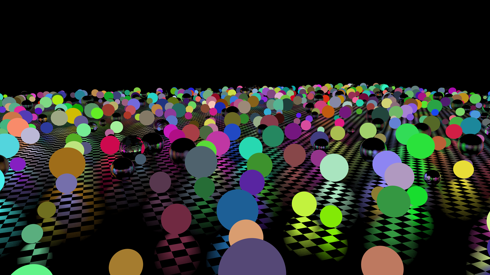

# Rustacean-Tracing

## A toy path tracer written in Rust. `WIP 🏗️`

This path tracer runs entirely on the cpu and is shape/object agnostic.  
Scenes are rendered on multiple threads.

This was really fun to work on and I am very happy with how it turned out.

## Gallery

#### Next Steps
- ~Specular Highlights~
- ~Reflection~
- ~Global illumination~
- ~Transparency/Refraction~
- ~Texture mapping~
- ~A few more shapes~
- ~Loading in .obj~
- another rewrite...

## References
- [Ray Tracing In One Weekend](https://raytracing.github.io/books/RayTracingInOneWeekend.html)
- [Ray Tracing The Next Week](https://raytracing.github.io/books/RayTracingInOneWeekend.html)
- [Loading in .obj Objects](https://github.com/perliedman)
